# Qtaichi ： 一个基于Taichi后端与Qt GUI前端的自由绘图仿真系统

### 2020 USTC计算机图形学课程作业

| 绘图                      | 粒子                       | 碰撞                       |
| ------------------------- | -------------------------- | -------------------------- |
|  |  | 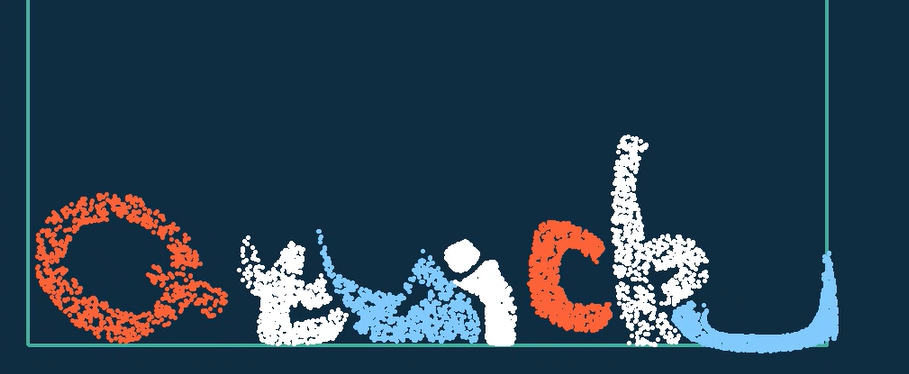 |

## 目录

1. 物质点法(MFM)原理

   1. Hybrid Eulerian/Lagrangian Material Point Method 

   2.  Moving Least Squares Material Point Method (MLS-MPM)
   
2. 实现：Qtaichi ：一个基于Taichi后端与Qt GUI前端的自由绘图仿真系统

   1. 整体设计思路

   2. 使用方法与界面介绍

   3. 关键问题与解决方法

      + 交互性
      + 粒子填充
      + 实现中的其他问题

3. 测试结果

   + 各项参数对雪仿真效果的影响实验
   + 射击子弹与雪人的碰撞
   + 下落水锥与弹簧床的碰撞
   + 下落弹性锥与水床的碰撞
   + 四个雪球相撞于一处
   + 弹性面、弹性球、雪球、水幕综合碰撞
   
4. 总结反思

5. 致谢

   
   
   

## 一. 物质点法(MFM)原理 

**1. Hybrid Eulerian/Lagrangian Material Point Method**

+ Lagrangian视角与Eulerian视角

  ​       力学中，Lagrangian视角与Eulerian视角是两种不同角度的力学处理方法。Lagranian视角聚焦于粒子，速度$V$与加速度$A$是粒子位置$X$和时间$t$的函数。一般选定粒子，通过对这些粒子空间位置的测量与计算得到速度与加速度。而Eulerian视角放眼于大量粒子形成的场，一般选定空间位置，测量通过这一位置的粒子的速度与加速度，如流量场。因此在流体仿真中Eulerian视角广泛使用，而在固体或者连续体仿真中使用Lagrangian视角更为自然。

  

+ 基本公式

  物体的变形可以被描述为从未变形状态$X$到变形状态$x$的映射：
  $$
  x = \phi(X)
  $$
  定义变形梯度(deformation gradient) $F = \frac{\part\phi}{\part X}$，$F$可以被分解为弹性形变与塑形形变两部分：$F=F_EF_P$。

  $\phi(x)$的变化遵循质量守恒、动量守恒与弹性-塑性本构方程
  $$
  \frac{D\rho}{Dt} = 0
  $$

  $$
  \rho \frac{Dv}{Dt} = \nabla \sigma + \rho g
  $$

  $$
  \sigma = \frac{1}{J}\frac{\part \Psi}{\part F_E}F_E^T
  $$

  其中：$\rho$是材料密度，$\sigma$是材料的柯西应力，$\Psi$是弹性-塑形势能密度，$J = det(F)$.

  

+ MFM的步骤

  MFM的步骤如下所示。其被称为Hybrid Eulerian/Lagrangian Material Point Method的原因是在过程中需要通过样条插值进行粒子质量/动量到空间网格质量/动量的转换（即从Lagrangian视角转换到Eulerian视角），最后在网格上进行相应求解后，再将网格质量/动量转换到空间网格质量/动量（从Eulerian视角转换回Lagrangian视角）。

  

**2. Moving Least Squares Material Point Method (MLS-MPM)**

​	MLS-MPM方法是SIGGRAPH2018胡渊鸣等人针对MFM计算速度慢、边界计算难以得到质量保证等缺点提出的一种新的物质点模拟方法。论文摘要如下：

## 二. 实现：Qtaichi —— 一个基于Taichi后端与Qt GUI前端的自由绘图仿真系统

在本次作业中，我实现了Qtaichi，一个基于Taichi后端与Qt GUI前端的自由绘图仿真系统。

1. **整体设计思路**

   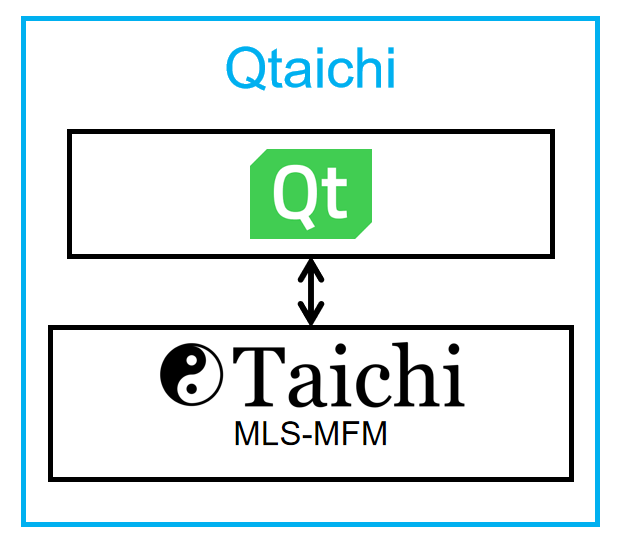

   

2. **使用方法与界面介绍**

   整体界面：

   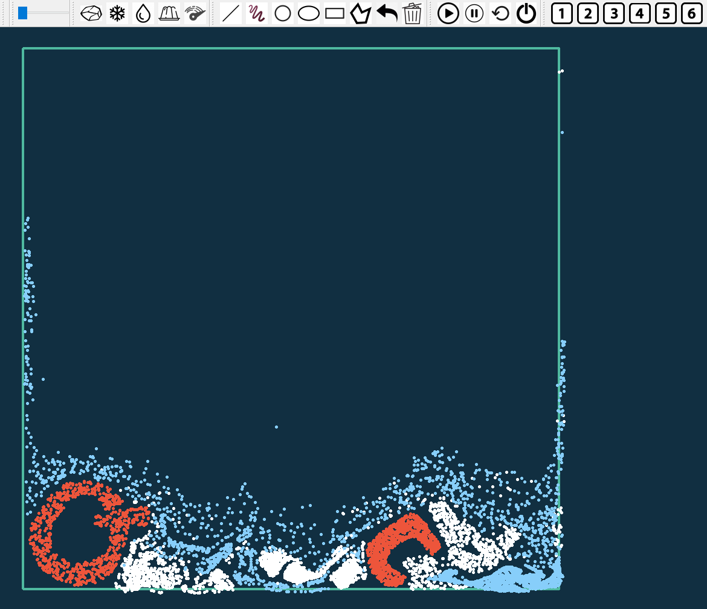

   

   粒子类型Icon

   | icon                                                         | 含义               | 功能                                                         |
   | ------------------------------------------------------------ | ------------------ | ------------------------------------------------------------ |
   |  | 选择粒子类型为雪   | 类型为雪时，画图的颜色为白色                                 |
   |  | 选择粒子类型为流体 | 类型为流体时，画图的颜色为淡蓝色                             |
   |  | 选择粒子类型为凝胶 | 选择粒子类型为流体类型为凝胶时，画图的颜色为橙色             |
   | 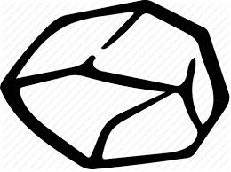 | 选择粒子类型为固体 | 类型为固体时，画图的颜色为黑色                               |
   |  | 绘制速度线         | 类型为速度线时，画图的颜色为红色，并设置图形类型为直线。速度的大小与速度线的长度成正比，方向为线的方向 |

   

   主要的画图工具Icon

   | icon                                                         | 含义         | 功能                                                         |
   | ------------------------------------------------------------ | ------------ | ------------------------------------------------------------ |
   | 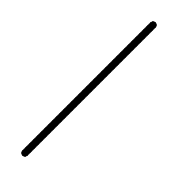 | 绘制直线     | 在Qtaichi中，直线用于绘制速度线（**需要注意的是**：物体的速度线必须在绘制该物体之后绘制，中间不能间隔其他物体的绘制） |
   |  | 绘制自由曲线 | 用户可以在Qtaichi中使用自由曲线绘制任意想要的图形：字母、雪人、子弹、城堡等 |
   |  | 绘制多边形   | 用户可以在Qtaichi中使用自由多边形绘制任意想要的多边形：斜坡、尖锥、平台等 |
   |  | 撤销绘图     | 撤销上一次绘图操作，方便重画图形                             |
   |  | 清空图形     | 清空界面中的所有图形                                         |

   仿真icon

   | icon                                                         | 含义     | 功能                                                         |
   | ------------------------------------------------------------ | -------- | ------------------------------------------------------------ |
   |  | 开始仿真 | 如果用户绘制了图形，Qtaichi将把封闭图形填充为相应类型的粒子，开始仿真 |
   |  | 暂停仿真 | 暂停仿真，方便用户截图、或者向仿真中加入新的物体（不暂停时也可以直接加入新物体），按“开始仿真”按钮恢复。 |
   |  | 回复     | 回复到上一次绘图的状态，方便重现仿真结果。                   |
   |  | 终止仿真 | 停止仿真，并清空所有粒子                                     |

   雪类型icon

   | icon                                                         | 含义                | 功能                                                         |
   | ------------------------------------------------------------ | ------------------- | ------------------------------------------------------------ |
   |  | 设置当前雪的类型为1 | 用于各项参数对雪仿真效果的影响实验。在“三.测试结果”中将会具体介绍每一种类型对应的雪的参数 |

   

3. **关键问题与解决方法**

   2. 交互性的设计

      + 自由绘图加入物体

        在使用taichi时，发现加入物体很麻烦，而且物体的形状难以编程控制，因此想到可以使用Qt进行绘制。在自由曲线绘图状态下，用户可以自由绘制一切可能的2D图形：字母、雪人、子弹、城堡、斜坡、尖锥、平台等，大大增强了仿真的自由度与趣味性。

      | 字母                                                | 雪人                                                | 斜坡                                                         | 城堡                                              |
      | --------------------------------------------------- | --------------------------------------------------- | ------------------------------------------------------------ | ------------------------------------------------- |
      |  |  | 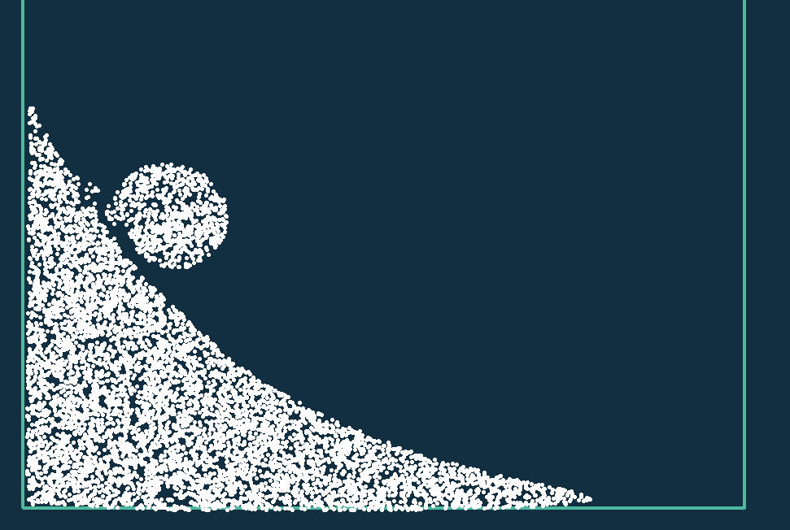 |  |
      
      + 可暂停、可回放
      
        用户能够暂停当前仿真，方便进行截图。并能够进行回复，方便进行实验结果的再现。
      
      + 可随时向仿真中加入新的带有初速度的物体
      
        用户在仿真进行的同时绘制新的物体，并使用速度线设置其初速度。
      
      
      
   2. 粒子的填充

      用户在自由绘制图像后，使用扫描线算法填充材料粒子。

      

   3. 实现中的其他问题

      + 如何让Taichi后端与Qt前端进行交互？

        本次实验Qt部分复用了HW1的``Minidraw``类和``Minidraw_controller``类。

        将taichi相关代码封装成一个类``Taichi_simulation``（实际中发现将``taichi.h``包含在``.h``文件中会报LINK错误，于是将``Taichi_simulation``类定义在``minidraw_controller.cpp``中）

        Taichi后端与Qt前端的交互主要是``Taichi_simulation``类与``Minidraw_controller``类的交互。

        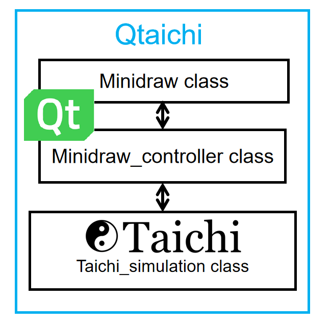

        

      + 如何让程序在进行仿真的无限循环时仍然能够相应用户点击？

        在无限循环中加入``QCoreApplication::processEvents();``

        

      + 不使用taichi的gui，如何绘制粒子？

        使用Qt绘制圆形并填充相应颜色即可。

        

      + 更新画面时遇到的问题：``repaint()``与``update()``

        在实现时，发现更新画面使用``update()``函数会出现绘制不及时的情况，使用``repaint()``代替``update()``可以解决这一问题。

        

## 三. 测试结果

​	视频分享链接：睿客网 [链接](https://rec.ustc.edu.cn/share/fe3060e0-7875-11ea-99d4-75bf6105942f)

1. **各项参数对雪仿真效果的影响实验**

   下图是SIGGRAPH2013 MFM论文中各项参数对雪仿真效果的影响实验结果。

   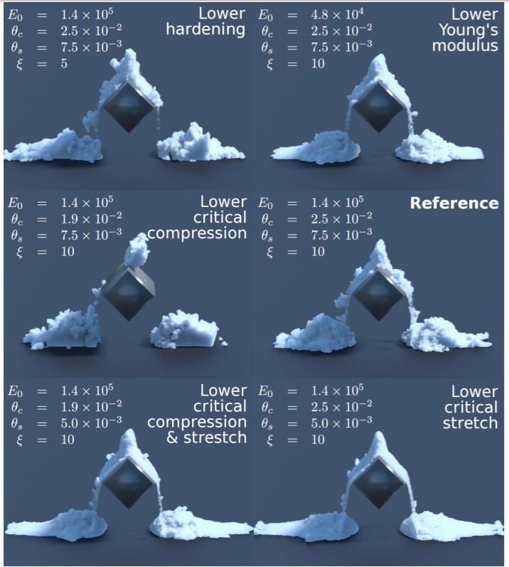

   各项参数的含义：

   | 参数       | 含义     |
   | ---------- | -------- |
   | $E_0$      | 杨氏模量 |
   | $\theta_c$ | 压缩阈值 |
   | $\theta_s$ | 拉伸阈值 |
   | $\xi$      | 硬度系数 |

   论文中的结论：

   

   在我的实验中，发现杨氏模量按照SIGGRAPH2013 MFM论文中设置为$10^{5}$次方量级会导致报错，原因应该是MLS-MFM与MFM的实现有差异导致的，因此将$E_0$按照MLS-MFM中$10^4$量级来设置。

   下表中的黑色三角形为一个硬度较大的弹性三角尖锥，雪块从上方自由落体，砸到尖锥上方然后裂开。

   | 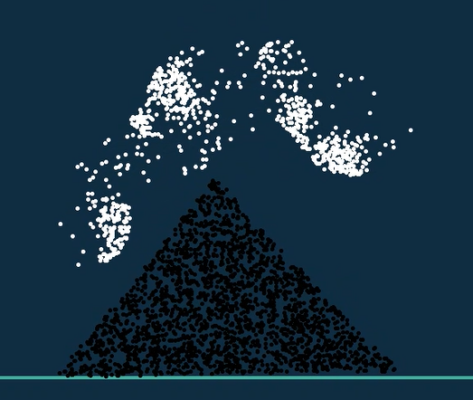           |            |
   | ------------------------------------------------------------ | ------------------------------------------------------------ |
   | 上图类型1 Lower Hardening：$E_0 = 1e4 \ \theta_c = 2.5e^{-2} \ \theta_s = 7.5e^{-3} \ \           \xi = 5.0$ | 上图类型2 Lower Young's Modulus: $E_0 = 0.2e4 \ \theta_c = 2.5e^{-2} \ \theta_s = 7.5e^{-3} \ \           \xi = 10.0$ |
   | 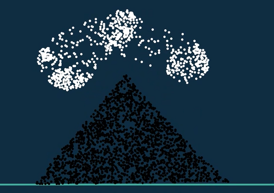           |            |
   | 上图类型3 Lower critical compression: $E_0 = 1e4 \ \theta_c = 1.9e^{-2} \ \theta_s = 7.5e^{-3} \ \           \xi = 10.0$ | 上图类型4 Reference:$E_0 = 1e4 \ \theta_c = 2.5e^{-2} \ \theta_s = 7.5e^{-3} \ \           \xi = 10.0$ |
   |            | 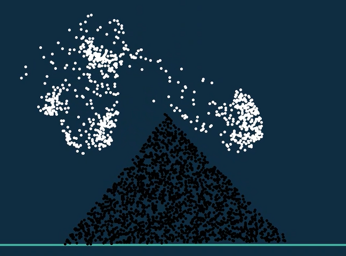           |
   | 上图类型5 Lower critical compression & strestch:$E_0 = 1e4 \ \theta_c = 1.9e^{-2} \ \theta_s = 5.0e^{-3} \ \           \xi = 10.0$ | 上图类型6 Lower strestch: $E_0 = 1e4 \ \theta_c = 2.5e^{-2} \ \theta_s = 5e^{-3} \ \           \xi = 10.0$ |

   从上表结果中可以看到：

   + 调低杨氏模量，会让雪变成粉末状的干雪，更容易碎成粉末，这与内部应力减少有关。
   + 调低硬度系数会让雪块变得更松软，碎裂程度更小（碎裂之后形成3小块）。
   + 调低$\theta_c,\theta_s$会影响雪的碎裂效果。

   

2. **射击子弹与雪人的碰撞**

   | 绘图                    | 仿真开始                 | 仿真中                   |
   | ----------------------- | ------------------------ | ------------------------ |
   |  |  | 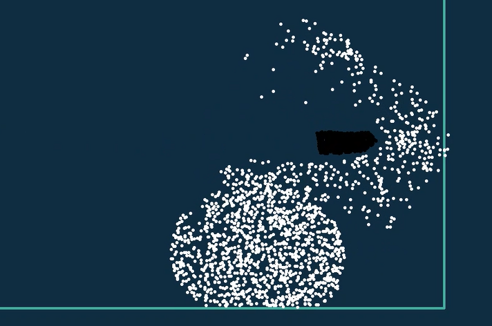 |

   

3. **下落水锥与弹簧床的碰撞**

   | 绘图                        | 仿真开始                     | 仿真中                       |
   | --------------------------- | ---------------------------- | ---------------------------- |
   |  | 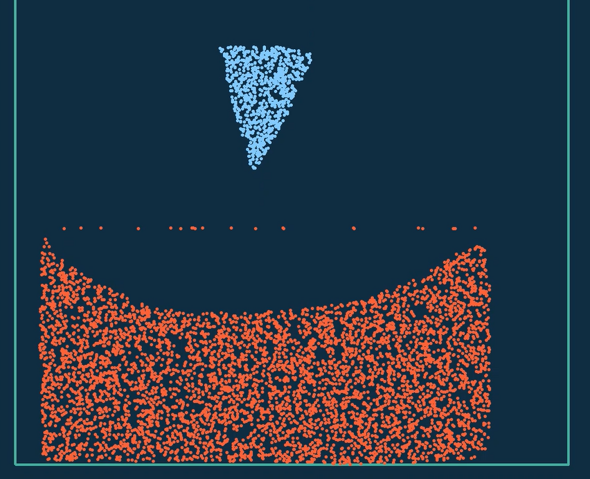 |  |

   

4. **下落弹性锥与水床的碰撞**

   | 绘图                        | 仿真开始                     | 仿真中                       |
   | --------------------------- | ---------------------------- | ---------------------------- |
   |  |  |  |

   

5. **四个雪球相撞于一处**

   | 绘图                        | 仿真开始                     | 仿真中                       |
   | --------------------------- | ---------------------------- | ---------------------------- |
   | 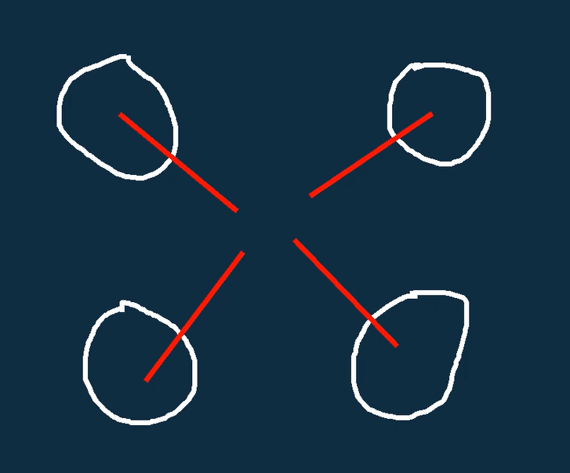 |  | 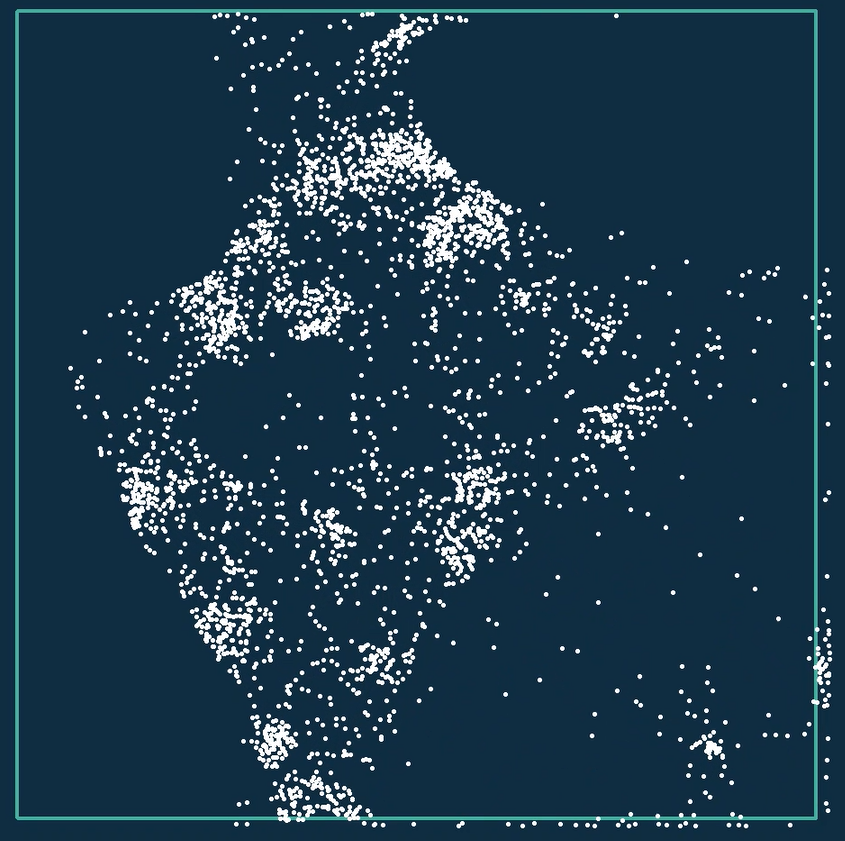 |

   

6. **弹性面、弹性球、雪球、水幕综合碰撞**

   | 绘图                    | 仿真开始                 | 仿真中                   |
   | ----------------------- | ------------------------ | ------------------------ |
   |  |  | 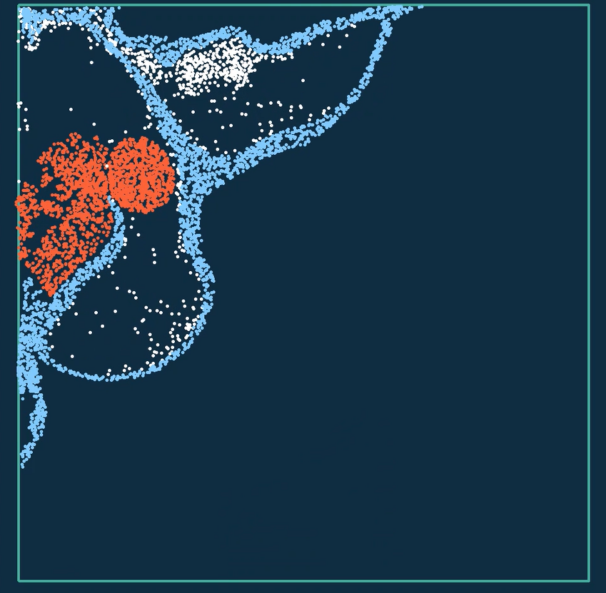 |

## 四. 总结反思

1. 潜在的bug

   + 类接口的分离做得比较粗糙，目前3个类存在一定的耦合现象，不够整洁。

   + 目前使用三角形绘图时会导致程序死循环：可能是扫描线边界条件没有处理好，在未来有空时解决。

   + 潜在的内存泄露

     

2. 迟交的原因

   + 阅读MFM教程与论文花费时间较多，原理由于数学物理知识太多十分难懂。

   + 前期准备做一个台球游戏，但是仔细查看taichi的代码时发现修改已有物体速度很不容易（如球棍敲击白球改变其速度），而且交互很麻烦，于是放弃了这个想法。

   + 之后调研可能的图形界面，花了一些时间了解Dear Imgui，发现Dear Imgui并不适合本次作业，于是放弃，转而使用qt

   + 在周日下午与同学讨论时想到可以使用Qt自由绘制图形并填充粒子，意识到这是一个非常有趣的idea，于是决定花时间实现一下。

   + 周日晚、周一：完成程序的编写、调试、测试，并撰写报告

   + 周二上午：完成激动人心的报告的撰写。

     

## 五. 致谢

+ 自由绘制仿真的idea来自张永停同学的启发：在周日下午与张永停同学讨论时想到可以使用Qt自由绘制图形并填充粒子，意识到这是一个比台球游戏有趣得多的idea。在此感谢张永停同学的帮助！
+ 在实现扫描线算法时借鉴了王瑞程同学HW3的扫描线算法实现，非常感谢！

